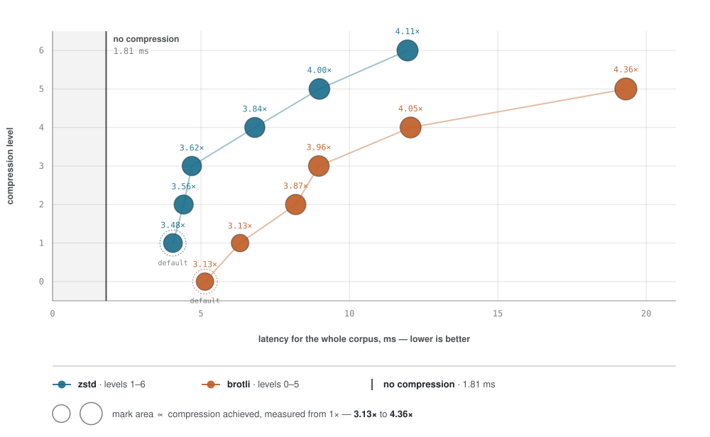
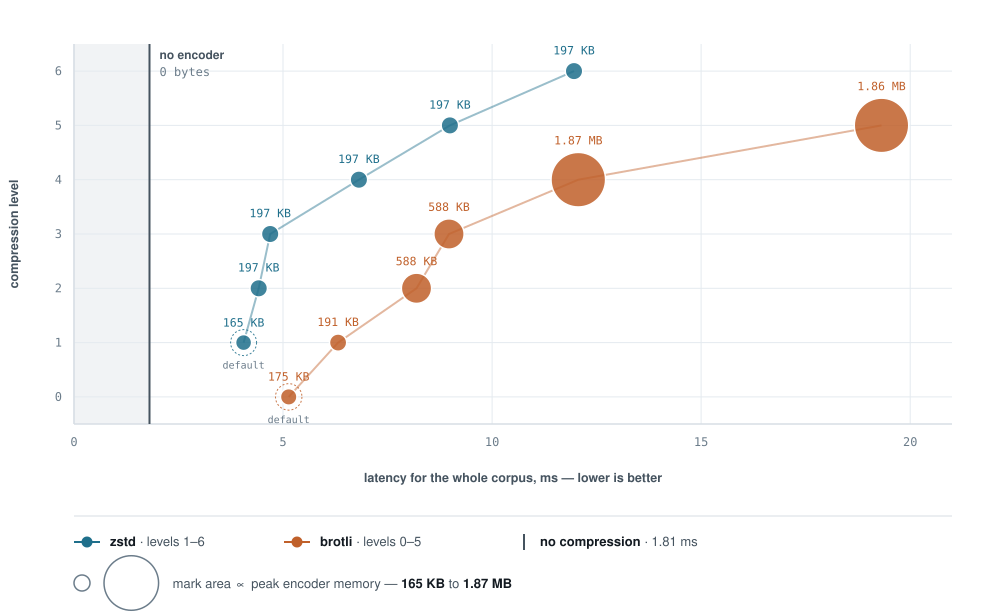

# ngx_pack

ngx_pack is an nginx module for compressing HTTP responses, built around
two codecs: [Zstandard](https://facebook.github.io/zstd/), a modern
LZ77-and-entropy-coding design that reaches deflate-class ratios or
better at a fraction of the CPU, and
[Brotli](https://github.com/google/brotli), a similar LZ77-and-entropy-coding
design that adds context modeling - choosing an entropy table from the bytes
just seen - and a built-in static dictionary of common web strings, trading
some of that speed for a tighter ratio at its higher quality levels.

It ships as two nginx modules: a **filter module** that compresses
responses as they are produced, streaming or not, and a **static
module** that instead serves an already-compressed sibling file
straight from disk whenever one exists, skipping the encoder
altogether. Both codecs are compiled into the filter module at all
times; the `pack` directive documented below is what decides, per
location, which codec a request actually gets and in what order of
preference - Zstandard first with Brotli as an always-on fallback being
the combination this module is built around.

## TL;DR configuration recommended for production

The default settings have been optimized for low latency and minimal
peak memory consumption while still maintaining a good compression
ratio. Tests on `script/corpus` (check [PROVENANCE.md](./script/corpus/PROVENANCE.md)) show that zstd is superior to brotli
at dynamic compression while brotli offers better compression ratio at
its maximum settings, making it an ideal choice for static content.
This makes zstd the obvious choice for dynamic content compression
with brotli being the fallback for older browsers or clients that do
not support zstd (yet). Therefore, the following config
is recommended for production environments:

```nginx
# serves zstd if supported by the browser,
# brotli (unconditionally) otherwise.
pack zstd br=always;

# Put pack_static config to the location
# from where you serve static, pre-compressed
# files (with brotli for best results).
pack_static always;
pack_static_encodings br;

# nginx looks up a static, pre-compressed file on each request,
# which translates to a syscall (open) on each request.
# To cache those lookups, add the following directives to your
# config.
open_file_cache        max=1000 inactive=60s;
open_file_cache_errors on;

pack_types
    application/eot application/font application/font-sfnt
    application/font-woff application/geo+json application/graphql+json
    application/javascript application/javascript-binast application/json
    application/ld+json application/manifest+json application/opentype
    application/otf application/rss+xml application/truetype application/ttf
    application/vnd.api+json application/vnd.ms-fontobject application/wasm
    application/x-httpd-cgi application/x-javascript application/x-opentype
    application/x-otf application/x-perl application/x-protobuf application/x-ttf
    application/xhtml+xml application/xml font/otf font/ttf font/x-woff
    image/svg+xml image/vnd.microsoft.icon image/x-icon multipart/bag
    multipart/mixed text/css text/javascript text/js text/plain text/richtext
    text/x-component text/x-java-source text/x-markdown text/x-script text/xml;
```

With this configuration you don't need to enable gzip for ancient clients. Brotli will be served unconditionally if zstd is not
supported. As of today, this config covers all modern browsers as every major browser supports brotli, but not zstd. Everything else is covered by the default settings with each directive described below.

The rationale to use the minimal compression level (quality setting
for brotli) with a window size of `16k` can be described by the
following charts.

#### Compression ratio at various compression levels

<picture>
  <source media="(prefers-color-scheme: dark)" srcset="./script/bench/codec-ratio-dark.svg">
  
</picture>

#### Peak memory consumption at various compression levels

<picture>
  <source media="(prefers-color-scheme: dark)" srcset="./script/bench/codec-memory-dark.svg">
  
</picture>

Note that the window size can be lowered further. Both `8k` or `4k` are
valid settings and cut memory consumption per request further. For
example, peak memory consumption with the window set to `4k` is below
`64k` for both codecs. However, lower window settings increase latency.
Always measure both latency and memory consumption when tweaking the
settings of both encoders.

## Configuration directives

### `pack`

- **syntax**: `pack off;` or `pack <codec>[=always];` or
  `pack <codec> <codec>[=always];`, where `<codec>` is `zstd` or `br`
- **default**: `off`
- **context**: `http`, `server`, `location`, `if in location`

Chooses which codec(s) this location may serve, and the order client
preference is checked in. Naming one codec enables that codec alone. Naming
two ranks the first ahead of the second: a client that accepts the first
codec is always given it, and the second is only ever reached once the
first has declined.

Appending `=always` to the codec named **last** turns it into an
unconditional fallback: once every codec ranked ahead of it has declined,
it is served regardless of what `Accept-Encoding` says.

Examples:

```nginx
pack zstd;           # zstd only.

pack br;             # brotli only.

pack zstd=always;    # zstd regardless whether the client
                     # lists it in Accept-Encoding.

pack zstd br;        # zstd preferred over brotli.

pack zstd br=always; # zstd preferred, brotli
                     # unconditionally otherwise.

pack off;            # no compression.
```


### `pack_types`

- **syntax**: `pack_types <mime_type> [..]`
- **default**: `text/html`
- **context**: `http`, `server`, `location`

Enables compression of the specified MIME types in addition to `text/html`,
shared between both codecs - a response either is or is not worth
compressing, regardless of which codec would end up doing it. The special
value `*` matches any MIME type. Responses with the `text/html` MIME type
are always compressed.


### `pack_proxied`

- **syntax**: `pack_proxied off|any`
- **default**: `off`
- **context**: `http`, `server`, `location`

Whether a request that reached this server through another proxy (carrying
a `Via` header) may be compressed, shared between both codecs for the same
reason `pack_types` is. Matches `gzip_proxied`'s default and its `any`
value; the rest of `gzip_proxied`'s values key off response headers this
module does not read, so they have no equivalent here.


### `pack_zstd_level`

- **syntax**: `pack_zstd_level <level>`
- **default**: `1`
- **context**: `http`, `server`, `location`

Sets the Zstandard compression `level`. Acceptable values are in the range
from `1` to `6`. Zstandard's negative levels, and its higher levels up to
`22`, are not exposed through this directive - see the notes below.


### `pack_zstd_window`

- **syntax**: `pack_zstd_window <size>`
- **default**: `16k`
- **context**: `http`, `server`, `location`

Sets the Zstandard compression window `size`. Acceptable values are `4k`,
`8k`, `16k`, `32k`, `64k`, `128k`, `256k`, `512k` and `1m`. The ceiling is
memory, not compatibility - decoders accept far larger windows, but encoder
memory scales with the window and a server pays that per request in flight.


### `pack_zstd_buffers`

- **syntax**: `pack_zstd_buffers <number> <size>`
- **default**: `4 16k`
- **context**: `http`, `server`, `location`

Sets the maximum `number` of output buffers (between `1` and `8`) one
response may fill before it has to wait for the client to take them,
and the `size` of each (between `16k` and `128k`). Both parameters are
required, as with `gzip_buffers`, and both are checked when the
configuration is read.

The `number` is a ceiling rather than an allocation: buffers are
created only as the encoder actually runs out of free ones, so most
responses never reach it. Above `128k` a larger `size` can do nothing,
since Zstandard emits at most one block per call and a block is
`MIN(pack_zstd_window, 128k)`; below a page the fixed cost of a round
starts to outweigh what the round carries. Most deployments have no
reason to change either.


### `pack_zstd_min_length`

- **syntax**: `pack_zstd_min_length <length>`
- **default**: `256`
- **context**: `http`, `server`, `location`

Sets the minimum `length` of a response that will be compressed. The length is
taken from the `Content-Length` response header field. Some responses
are compressed regardless of this setting. See notes below.


### `pack_brotli_level`

- **syntax**: `pack_brotli_level <level>`
- **default**: `0`
- **context**: `http`, `server`, `location`

Sets the Brotli compression `level` (Brotli calls this "quality").
Acceptable values are in the range from `0` to `5`. Brotli's higher
levels, up to `11`, are not exposed through this directive - see the
notes below.


### `pack_brotli_window`

- **syntax**: `pack_brotli_window <size>`
- **default**: `16k`
- **context**: `http`, `server`, `location`

Sets the Brotli compression window `size`. Acceptable values are the same
nine sizes `pack_zstd_window` takes, `4k` through `1m`. Unlike
Zstandard's, this is what the encoder gets to work with regardless of the
response's own size - Brotli bounds its own buffers by the input it is
actually given, so naming a wide window for a small body costs nothing
extra.


### `pack_brotli_buffers`

- **syntax**: `pack_brotli_buffers <number> <size>`
- **default**: `4 16k`
- **context**: `http`, `server`, `location`

The same shape and bounds as `pack_zstd_buffers` - a `number` between `1`
and `8`, a `size` between `16k` and `128k`, both required. The encoders
differ in what a buffer costs, not in how many keep a response moving.


### `pack_brotli_min_length`

- **syntax**: `pack_brotli_min_length <length>`
- **default**: `256`
- **context**: `http`, `server`, `location`

Sets the minimum `length` of a response Brotli will compress, the same
way `pack_zstd_min_length` does for Zstandard - see the notes below.


### Notes on above settings

`pack_zstd_level`: a high level costs mostly CPU, and only mildly memory -
the module tells the encoder what to expect, so the match-finding tables
stay sized to the response rather than growing with the level. Measured
against `script/corpus` at the compiled-in `16k` window: level `1` (the
default) compresses the 1,283,760-byte corpus to 368,643 bytes in 3.70 ms
per request, level `3` to 354,669 bytes in 4.39 ms, and level `6` to
312,117 bytes in 11.57 ms - roughly 3x the CPU across the range for about
15% smaller output. The directive stops short of Zstandard's own range (up
to `22`) because the top levels reach for its slowest match-finding
strategies for a ratio gain that keeps shrinking as the level climbs; see
`script/bench/bench_corpus.py` for what would justify raising the ceiling.


`pack_zstd_window` is the main influence on what a request costs in memory.
Measured against `script/corpus` at the default level, compressed bytes
against the highest per-request encoder memory seen: 368,643 / 169,097
bytes at the `16k` default, 349,923 / 312,513 at `32k`, 337,408 / 533,809
at `64k`, 326,916 / 976,401 at `128k`, 326,170 / 1,107,473 at `256k`, and
326,169 / 1,113,819 from `512k` on - ratio and memory both level off well
before the ceiling.


`pack_zstd_buffers` only matters when the socket will not take output as
fast as the encoder produces it - a slow client, a congested link, or
`limit_rate`. Buffers are created strictly on demand as the encoder runs
out of free ones, so a response that never outruns its client costs one
buffer whatever the count is set to; raising the count therefore costs
nothing on responses that keep up, and lets the ones that stall carry on
compressing into further buffers instead of stalling after the first, up
to the 8-buffer ceiling. `1` makes the encoder wait for each buffer to be
written before producing the next.


`pack_zstd_min_length`: a response of unknown length is held briefly so the
setting can still be applied to it, rather than being compressed
regardless. Once the end of the response is in hand its real size is known,
and the setting is applied normally.

The exception is a buffer marked for flushing that arrives *before* that
point, which is what `proxy_pass` with `proxy_buffering off` produces:
something downstream is waiting on bytes the filter is sitting on, so it
decides at once rather than holding the headers any longer, and deciding
without knowing the size means compressing. `pack_zstd_min_length` therefore
does not hold on an unbuffered proxied response - a small body is compressed
even at the `256` default, where the same body over a buffered `proxy_pass`,
or as a static file, is left alone.


`pack_brotli_level`: Brotli's own quality axis, `0` to `11`, is narrower here
for the same reason Zstandard's is. Measured against `script/corpus` at the
compiled-in `16k` window: quality `0` (the default) compresses the corpus to
409,530 bytes in 4.72 ms per request, quality `3` to 324,566 bytes in
8.75 ms, and quality `5` to 294,725 bytes in 18.83 ms.


`pack_brotli_window`: unlike Zstandard's, Brotli's own memory does not climb
smoothly with the window - measured at the default quality, peak per-request
memory is 179,463 bytes at the `16k` floor, then settles at 212,231 bytes
from `32k` on and does not move again through `1m`. Compressed size follows
the same shape: 409,530 bytes at `16k`, 398,026 bytes from `32k` on. Past
`32k` this directive has nothing left to buy on the corpus measured here,
though a body with redundancy further apart than that could still see a
ratio gain from raising it.


`pack_brotli_min_length` and `pack_zstd_min_length` behave identically -
see the notes on `pack_zstd_min_length` above.


## Static module

Serves a pre-compressed sibling file from disk in place of the original,
without creating an encoder. The request costs neither compression CPU nor
encoder memory, so prefer it wherever the content is static.


### `pack_static`

- **syntax**: `pack_static on|off|always`
- **default**: `off`
- **context**: `http`, `server`, `location`

Enables or disables checking for the existence of a pre-compressed sibling
file, in the encodings and order `pack_static_encodings` names.

With `on`, a sibling is served only to a client whose `Accept-Encoding`
takes its encoding, and `Vary: Accept-Encoding` is set on every response
the location serves - whether or not this module ends up serving the
request, and whether or not a sibling exists at all. What varies is the
location, not the one request.

With `always`, the first sibling found is served regardless of what the
client's `Accept-Encoding` says. Nothing is added to `Vary`, since every
client receives the same bytes.


### `pack_static_encodings`

- **syntax**: `pack_static_encodings <encoding> [..]`
- **default**: `br gzip zstd`
- **context**: `http`, `server`, `location`

Which pre-compressed siblings to look for, and in what order to probe for
them - `br` for a `.br` sibling, `gzip` for `.gz`, `zstd` for `.zst`. Only
the encodings a request's own `Accept-Encoding` accepts are ever probed, so
a client that negotiates none of them costs no filesystem lookup at all.
Naming an encoding twice is a warning, and the repeat is ignored; naming
anything else refuses the configuration outright.

Combining `pack_static always` with more than one encoding here is
ambiguous - whichever sibling is found first is served to every client,
regardless of what any client's `Accept-Encoding` would otherwise pick -
and is logged as a warning rather than refused, since a location whose
clients are all known to take the same encoding is a fair use of the
combination.


### Notes on the static module

An eligible request probes only for the encodings its own `Accept-Encoding`
takes, so a client that negotiates nothing costs no probe at all. When the
file a probe names does not exist, that probe reaches the filesystem **on
every request** unless negative results are cached too. Caching both requires
the following directives:

```nginx
open_file_cache        max=1000 inactive=60s;
open_file_cache_errors on; # without this the miss is never cached
```

`open_file_cache` on its own is not enough. Second directive caches the misses
in addition to cache hits, so that nginx doesn't have to check the filesystem
on every request.
